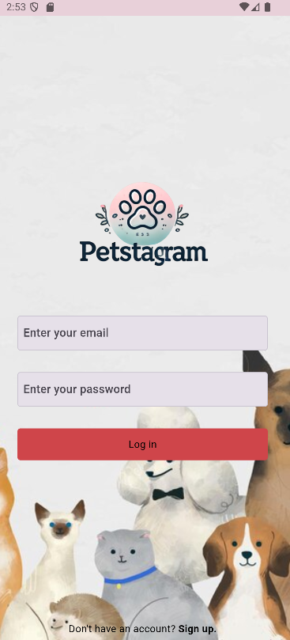
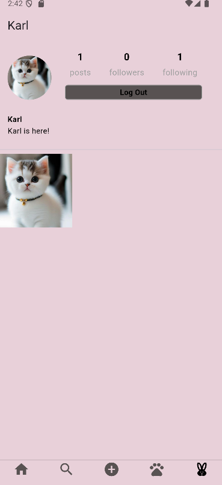
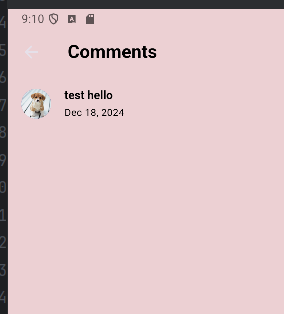
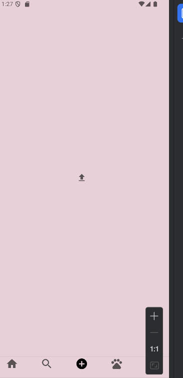

# 🐾 Petstagram

Petstagram is a social media mobile application inspired by Instagram, designed exclusively for pet lovers. Users can create profiles for their pets, share photos, interact with posts, and engage with a real-time feed. The app focuses on performance, scalability, and a clean user experience.

---

## 🚀 Features

- 🔐 **Secure Authentication**
  - User login and signup using Firebase Authentication
  - Profile management with pet bio and profile picture

- 🐶 **Pet Profiles**
  - Personalized pet profiles
  - View posts, followers, and following counts

- 🖼️ **Post Creation**
  - Upload pet photos with captions
  - Images stored using Firebase Storage (Google Cloud Platform)

- 📰 **Interactive Feed**
  - Real-time feed powered by Cloud Firestore
  - Like posts and view updates instantly
  - Optimized Firestore queries for low-latency data retrieval

- 💬 **Comments**
  - Add and view comments on posts in real time

- 📱 **Modern UI**
  - Designed using Figma
  - Pet-themed UI with bottom navigation

---

## 🛠️ Tech Stack

- **Frontend:** Flutter, Dart  
- **Backend / Services:** Firebase  
- **Database:** Cloud Firestore  
- **Authentication:** Firebase Authentication  
- **Storage:** Firebase Storage (Google Cloud Platform)  
- **Design:** Figma  

---

## 📸 App Screenshots

### Login Screen

### Sign Up Screen

### Profile Page

### Feed View

### Comments Section

### Create Post

### Caption Entry

---

## 📦 APK

A release APK is included in the repository for testing purposes.
